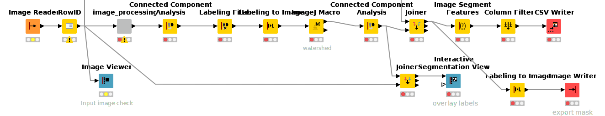
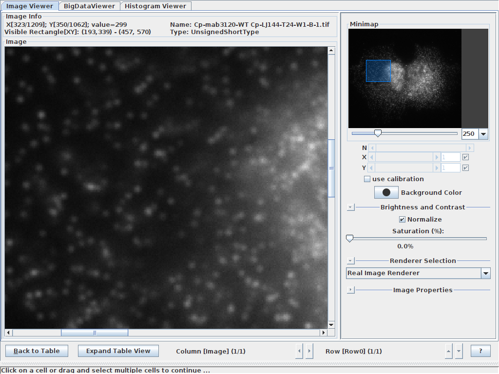
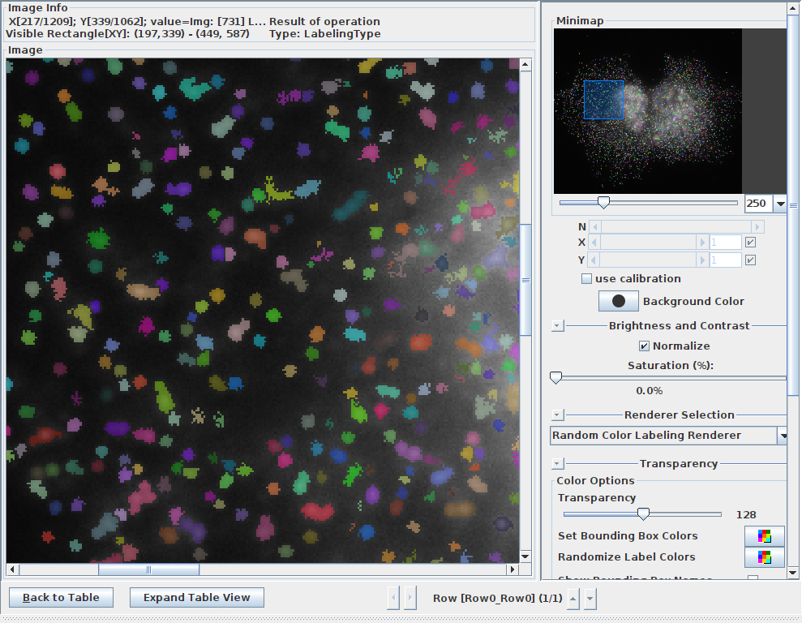

# puncta-segmentation

This [KNIME](https://www.knime.com/) workflow segments puncta from single channel 2D images. Briefly, input images are blurred using a Gaussian filter, subtracted form the original image (leaving the puncta signal), applied a thresold and labaled with a conncted component analysis (eight-connected). 

**puncta-segmentation workflow**

## Example images
View of input sample image:

View of output sample image with detections/labels:
